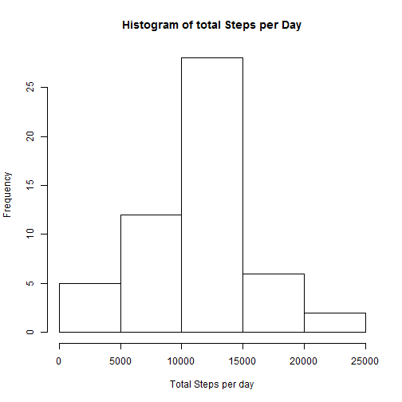
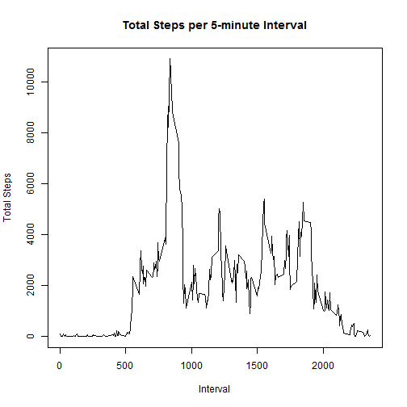
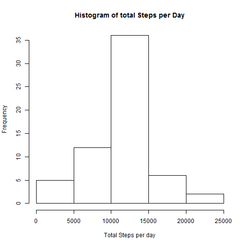

<h2><a id="user-content-loading-and-preprocessing-the-data" class="anchor" href="#loading-and-preprocessing-the-data" aria-hidden="true"><span class="octicon octicon-link"></span></a>Loading and preprocessing the data</h2>
The data was read from the "activity.csv" file located in the working directory

```r
activity_data <- read.csv("activity.csv")
```

<h2><a id="user-content-what-is-mean-total-number-of-steps-taken-per-day" class="anchor" href="#what-is-mean-total-number-of-steps-taken-per-day" aria-hidden="true"><span class="octicon octicon-link"></span></a>What is mean total number of steps taken per day?</h2>
In order to look at the average number of steps taken each day, first we aggregate the total steps taken per day, then plot this data as a histogram:

```r
##aggregate total steps by day
activity_agg <-aggregate(activity_data$steps, by = list(activity_data$date), sum)
##create histogram of steps per day
hist(activity_agg$x, main="Histogram of total Steps per Day",xlab="Total Steps per day")
```

 
  
Then we can calculate the mean and median of total stpes per day:

```r
mean_steps <- mean(activity_agg$x, na.rm=TRUE)
median_steps <- median(activity_agg$x, na.rm=TRUE)
```
This gives us a mean of 1.0766189 &times; 10<sup>4</sup> and a median of 10765.


<h2><a id="user-content-what-is-the-average-daily-activity-pattern" class="anchor" href="#what-is-the-average-daily-activity-pattern" aria-hidden="true"><span class="octicon octicon-link"></span></a>What is the average daily activity pattern?</h2>
To examine this, we can make a plot to look at the number of steps taken per 5-mintue interval.

```r
##average daily activity patterns (5-minute intervals)
activity_int <- aggregate(activity_data$steps, by = list(activity_data$interval), sum, na.rm = TRUE)
plot(activity_int$Group.1, activity_int$x, type = "l",main="Total Steps per 5-minute Interval",xlab = "Interval",ylab="Total Steps")
```

 
  
The interval with the highest number of steps can be calculated:

```r
highint <-activity_int$Group.1[which.max(activity_int$x)]
high_steps <- max(activity_int$x)
```

So interval 835 had the most total steps with 10927 total steps.


<h2><a id="user-content-imputing-missing-values" class="anchor" href="#imputing-missing-values" aria-hidden="true"><span class="octicon octicon-link"></span></a>Imputing missing values</h2>

To input missing values, first we count the total number of missing values

```r
miss_val <- sum(is.na(activity_data$steps))
```
So there are 2304 missing values.

Next, the mean of steps taken per each interval is calculated.

```r
int_means <- aggregate(activity_data$steps, by = list(activity_data$interval), mean, na.rm = TRUE)
```
This is then appended onto the original data matched by intervals, then the NA values in the steps column are replaced by the corresponding means, creating a new dataset with all missing values replaced by the overall mean for that interval.

```r
newdata <- merge(activity_data, int_means, by.x = 3, by.y = 1)
newdata$steps[is.na(newdata$steps)] <- newdata$x[is.na(newdata$steps)]
```
We can then look at the same histogram used earlier with the NA's removed

```r
##create histogram of steps per day with NA's removed
new_agg <-aggregate(newdata$steps, by = list(newdata$date), sum)
hist(new_agg$x, main="Histogram of total Steps per Day",xlab="Total Steps per day")
```

 
  
This shows that the replaced values did not have a significant effect on the distribution.

We calculate the updated mean and median.

```r
new_mean_steps <- mean(new_agg$x)
new_median_steps <- median(new_agg$x)
```
This gives us a mean of 1.0766189 &times; 10<sup>4</sup> and a median of 1.0766189 &times; 10<sup>4</sup> compared to our earlier mean and median of 1.0766189 &times; 10<sup>4</sup> and 10765 respectively.

<h2><a id="user-content-are-there-differences-in-activity-patterns-between-weekdays-and-weekends" class="anchor" href="#are-there-differences-in-activity-patterns-between-weekdays-and-weekends" aria-hidden="true"><span class="octicon octicon-link"></span></a>Are there differences in activity patterns between weekdays and weekends?</h2>

To examine potential differences in daily activity between weekends and weekdays, first we must create an indicator in the data to differentiate between weekends and weekdays.

```r
##create factor variable for weekdays and weekends
days <- weekdays(as.Date(newdata$date, format = "%Y-%m-%d"))
weekend <- c('Saturday', 'Sunday')
days2 <- c('Weekday', 'Weekend')[days %in% weekend+1L]
wewd_data <-cbind(newdata,days2)
wewd_data$x <- NULL
```
Then we calculate the means for each interval for both weekends and weekdays.

```r
##divide Weekends and Weekdays and find means for each interval
we_data <- wewd_data[wewd_data$days2=="Weekend",]
wd_data <- wewd_data[wewd_data$days2=="Weekday",]
we_agg <- aggregate(we_data$steps, by = list(we_data$interval), mean)
wd_agg <- aggregate(wd_data$steps, by = list(wd_data$interval), mean)
##Combine weekend and weekday data into one frame
we_agg2 <- cbind(we_agg,"weekend")
wd_agg2 <- cbind(wd_agg,"weekday")
names(we_agg2)[3]<-"day"
names(wd_agg2)[3]<-"day"
split_agg <- rbind(we_agg2,wd_agg2)
```
We can plot this data using the lattice system to compare the activity patterns.

```r
##plot average steps per interval Weekday vs. weekend
library(lattice)
xyplot(x~Group.1|day, split_agg, type="l", layout = c(1,2), xlab = "5-Minute Interval", ylab="Average Steps")
```

 
  
This shows us a higher morning peak for weekdays, but higher levels of activity throughout the day during weekends.

</article>
  </div>

</div>
